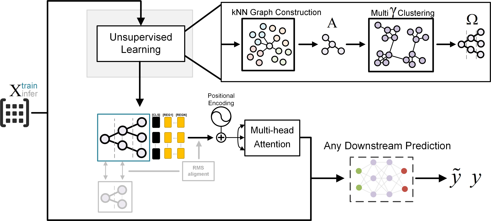
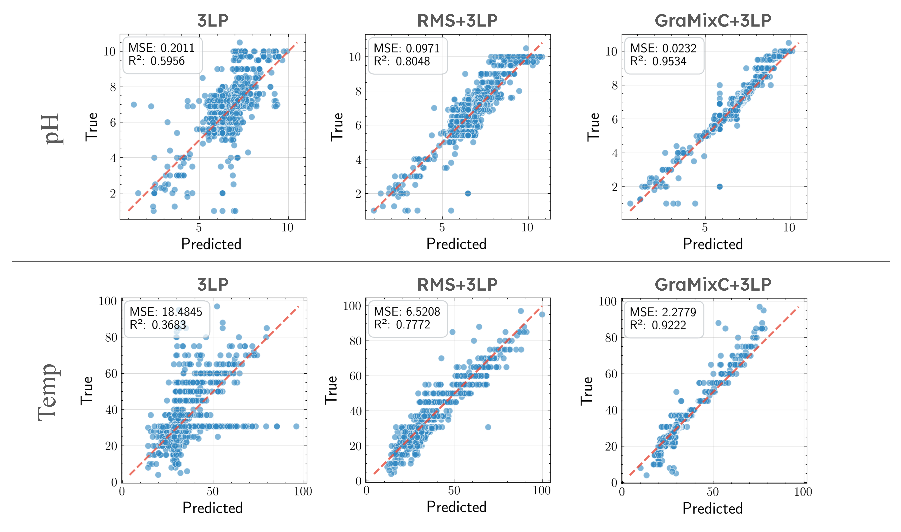
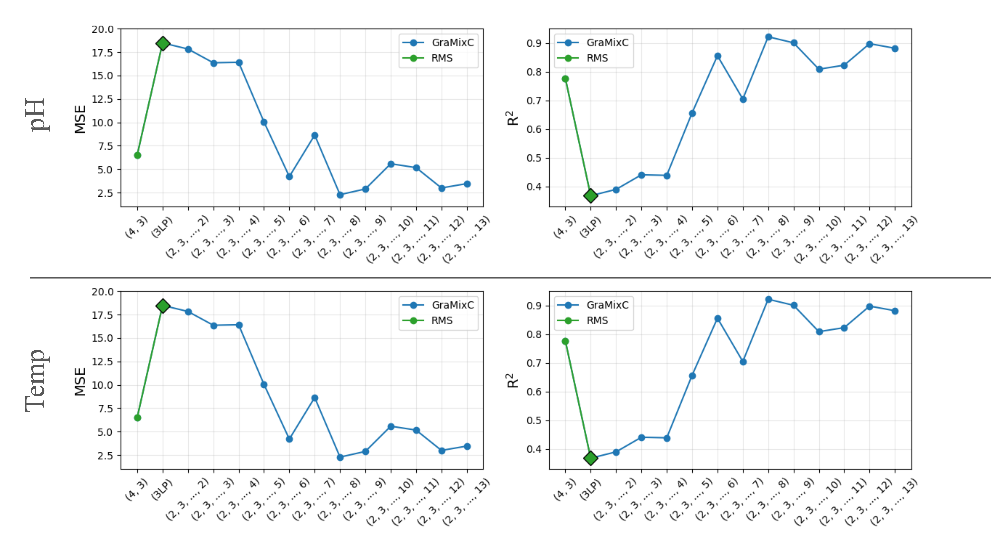

Humans are born with an ability to group objects by similarity—a cognitive mechanism that clustering seeks to replicate.
By community detection at optimal resolution parameters, recent work produces configurations—valid hierarchical clustering at each scale—all without any labels.
In this paper, we characterize configurations, and identify behaviors similar to them from the register tokens in Vision Transformers.
Configurations can be learned via unsupervised or self-supervised processes, but their selection or mixing is downstream task- and input-specific;
Compared to register tokens, configurations demonstrate less redundancy and require no ad hoc selection.
Utilizing these properties, we propose GraMixC, a plug-and-play module that extracts configurations, align them with our novel Reverse Merge/Split (RMS) methodology, and fuse them through attention heads, before passed back for any downstream predictor.
On the DSNI 16S rRNA cultivation task, GraMixC boosts coefficient of determination from 0.6 to 0.9—establishing a new state of the art.
We further validate GraMixC with standard tabular models on other benchmarks, where it consistently outperforms single-resolution and static-feature baselines.

