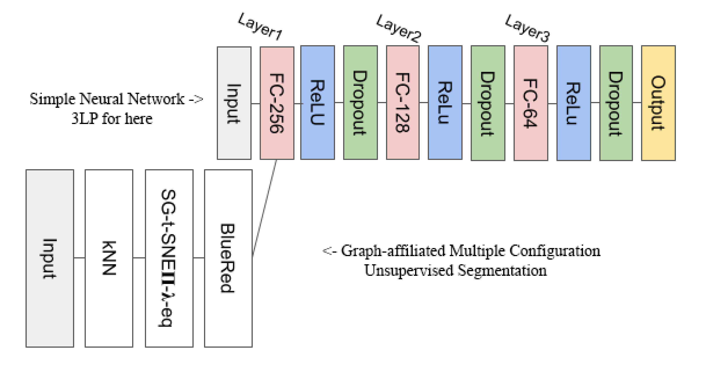
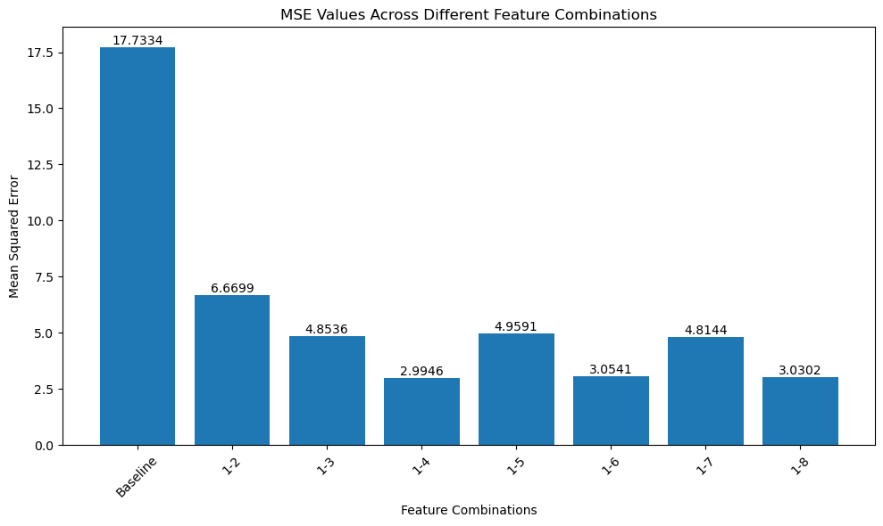
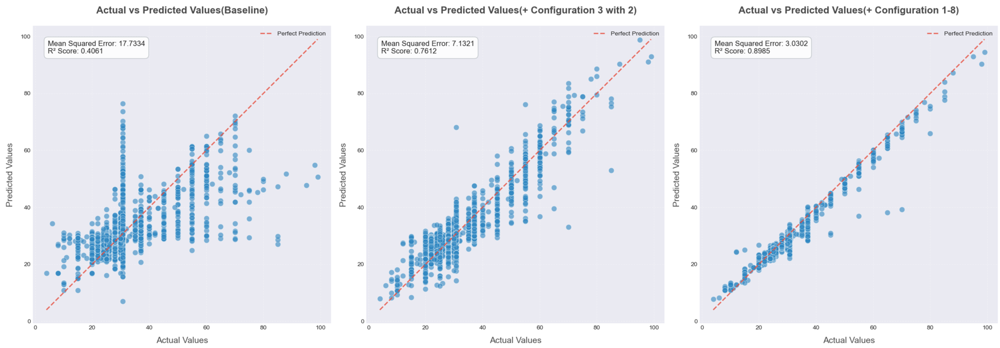
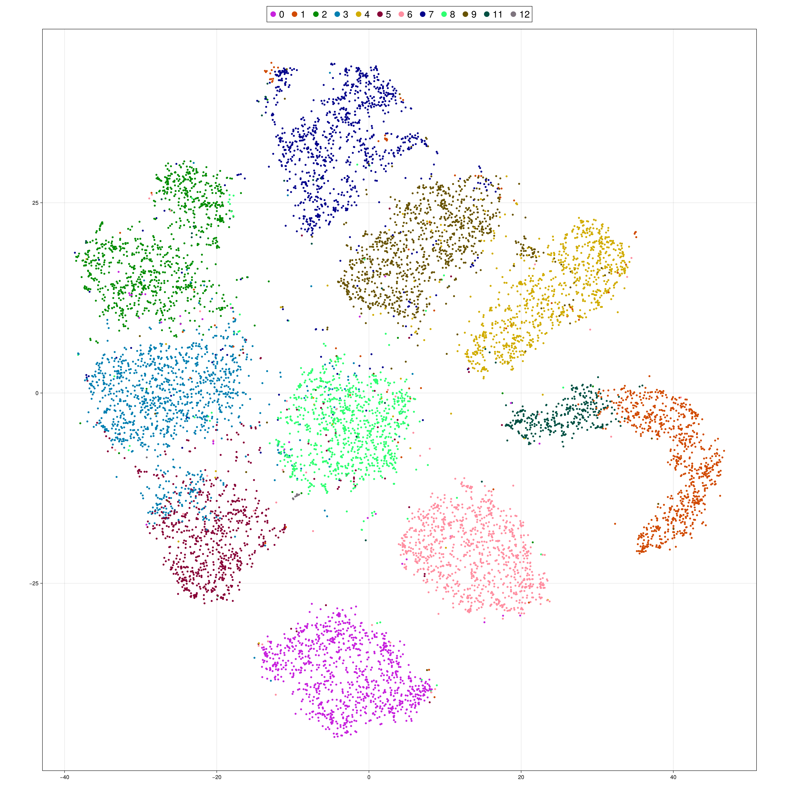
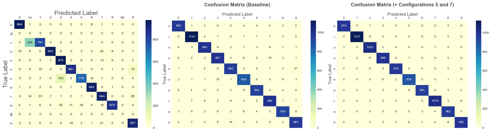

High-throughput 16S rRNA-seq data, complemented by detailed cultivation information, constitutes a critical resource in bacterial research with promising implications for biomedical applications such as fecal microbiota transplantation. However, the inherent high dimensionality and substantial costs associated with 16S rRNA-seq data constrain its full utility. In this paper, we introduce a novel approach—graph-affiliated unsupervised segmentation-assisted simple neural network (GASNN)—designed to analyze 16S rRNA-seq data efficiently. In a proof-of-concept application involving the prediction of cultivation media temperature, the GASNN model achieved significant performance enhancements over a traditional simple neural network (SNN). Further experiments across various tasks consistently demonstrated that GASNN improves the performance of SNN models. Nevertheless, a notable limitation of the proposed approach is that its benefits may diminish as the network architecture deepens, thereby impeding its ability to reveal the intrinsic manifold structure of the data.

