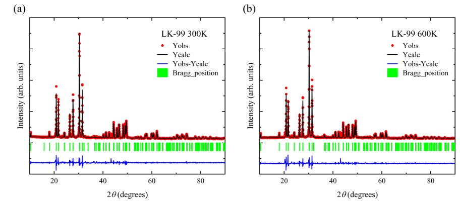
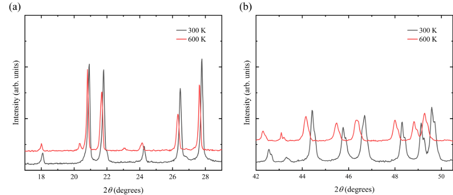

Some researchers suggest that the electrical properties of LK-99 may be induced by impurities such as Cu₂S. Single-crystal LK-99 synthesized at the Max Planck Institute was found to be highly insulating, with no evidence of superconductivity. Here, we investigate LK-99’s thermal behavior using temperature-dependent XRD, Raman spectroscopy, and DSC. XRD reveals reversible phase transitions between 300 K and 500 K, indicated by the emergence of new peaks and shifts in existing ones, which closely correlate with observed jumps in resistivity. Although DSC detects no strong latent heat, the structural changes suggest either the presence of a minor impurity phase or a subtle, intrinsic transformation in the copper-doped lattice. Raman spectra further support these findings, with vibrational modes shifting in tandem with the resistivity transition. These results indicate a temperature-sensitive material whose electrical response may be relevant for thermal sensing or switching applications, although the precise contributions of impurities versus intrinsic lattice effects require deeper microstructural analysis. The repeatable nature of LK-99’s structural and electrical transitions highlight its potential for functional electronics, pending further validation of purity, reproducibility, and long-term stability.

