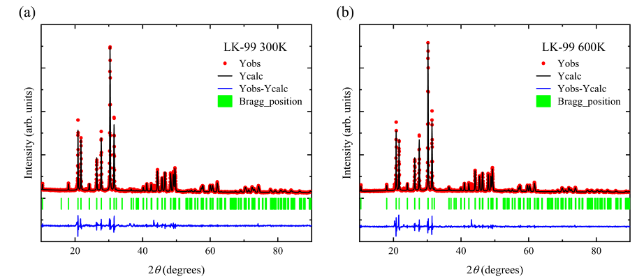
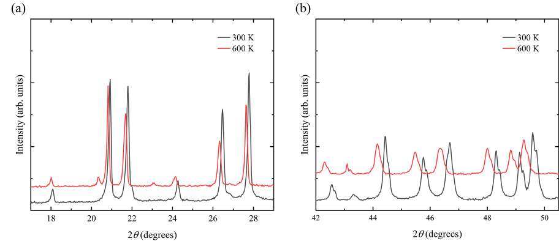

<!-- markdownlint-disable MD033 -->

## Abstract

Some researchers suggest that the electrical properties of Pb10-xCux(PO4)6O (LK-99) may be influenced by impurities such as Cu2S [1-3]. Single LK-99 crystals synthesized at the Max Planck Institute have shown significant changes in electrical resistance, but no evidence of superconductivity [4]. In this study, we employ temperature-dependent X-ray diffraction (XRD) and Raman spectroscopy to investigate LK-99’s structural and electrical properties. Temperature-dependent XRD (Figure 2) reveals phase transitions between 300 K and 500 K, accompanied by changes in diffraction patterns, including the emergence of new peaks and shifts in existing peaks. These transitions correlate with drastic, reversible changes in electrical resistance, suggesting that LK-99's unique conductivity behavior stems from the copper-substituted crystal lattice, where electron pathways may play a critical role. The magnitude of the resistance changes emphasizes LK-99’s temperature-sensitive nature, while the reversibility of the phase transitions indicates its potential for functional electronic applications. Raman spectroscopy (Figure 3) further supports these findings, showing significant shifts in vibrational modes, which are linked to the observed structural changes. The material’s stability under varying thermal conditions highlights its potential for use in temperature-sensitive electronic devices. Further investigation into reproducibility and purity is necessary to fully assess its functional capabilities and long-term stability.

<b>Figure 1:</b> X-ray diffraction fitting patterns of LK-99 at 300K and 600K as synthesis and purity justification.

<b>Figure 2:</b> Temperature-dependent X-ray diffraction patterns of LK-99 showing phase transitions.

<b>Figure 3:</b> Raman spectroscopy data showing temperature-induced shifts in vibrational modes corresponding to structural phase changes.

## References

[1] Lee, S.; Kim, J.; Kim, H.-T.; Im, S.; An, S.; Auh, K. H. Superconductor Pb10-xCux(PO4)6O Showing Levitation at Room Temperature and Atmospheric Pressure and Mechanism.

[2] Lee, S.; Kim, J.-H.; Kwon, Y.-W. The First Room-Temperature Ambient-Pressure Superconductor. 2023.

[3] Garisto, D. LK-99 Isn’t a Superconductor — How Science Sleuths Solved the Mystery. Nature 2023, 620 (7975), 705–706. <https://doi.org/10.1038/d41586-023-02585-7>.

[4] Puphal, P.; Akbar, M. Y. P.; Hepting, M.; Goering, E.; Isobe, M.; Nugroho, A. A.; Keimer, B. Single crystal synthesis, structure and magnetism of Pb10-xCux(PO4)6O.
